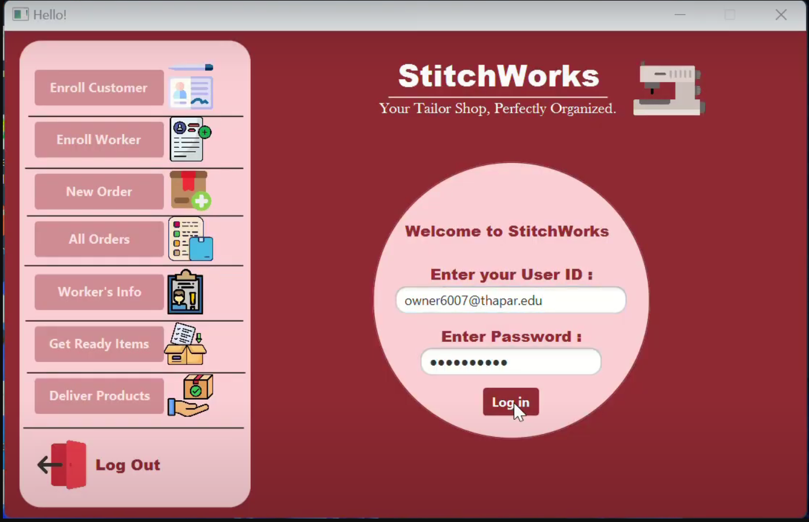
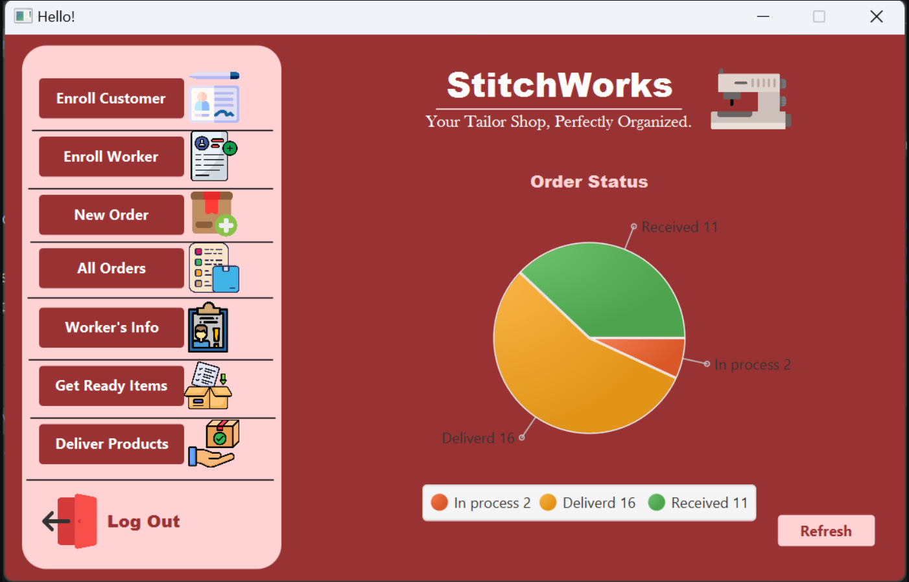
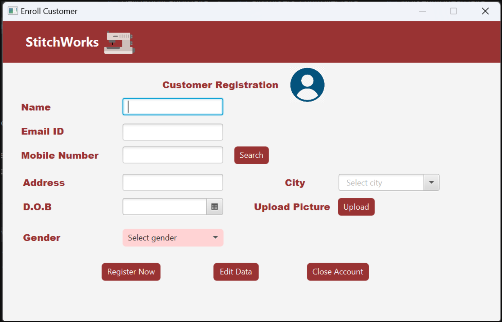
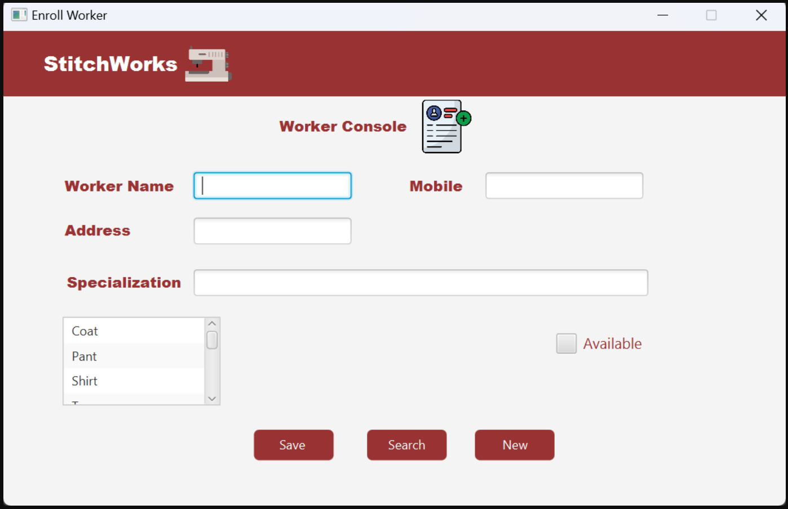
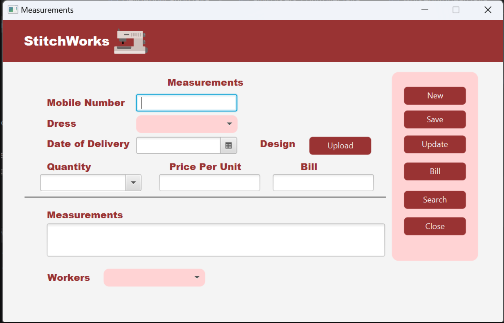
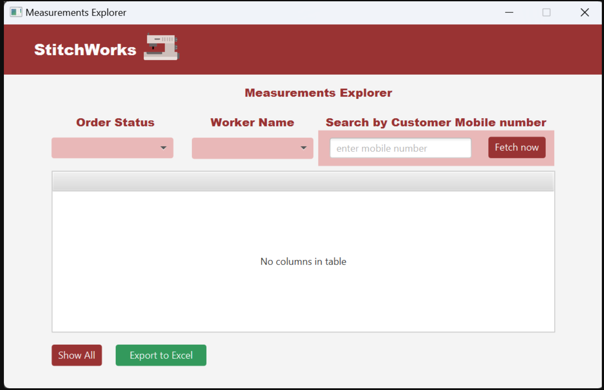
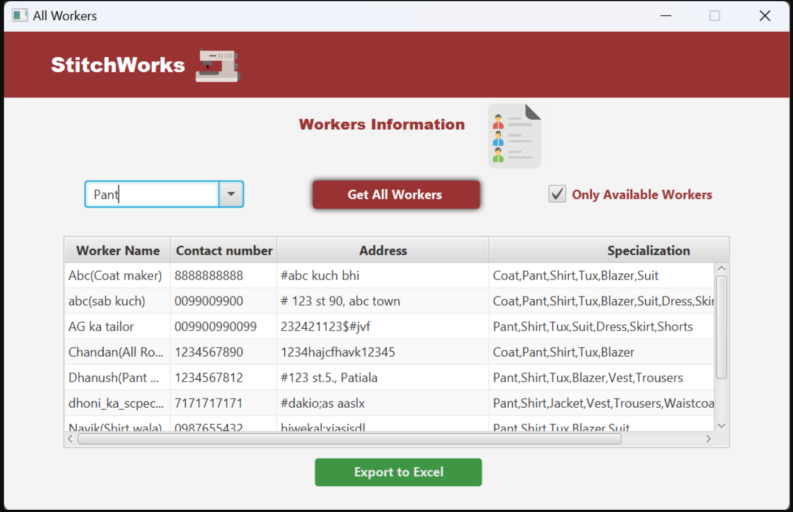
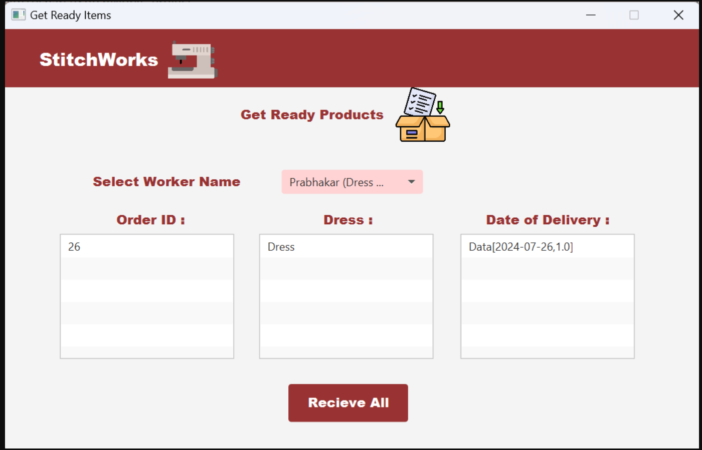
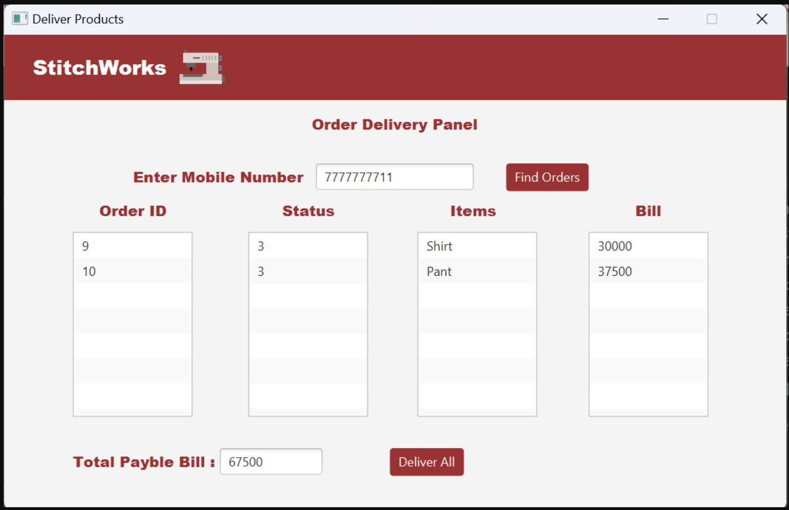

# StitchWorks_Project
StitchWorks - Tailor Business Management System
StitchWorks is a comprehensive desktop application developed using Java and JavaFX to streamline the operations of a tailor business. The system offers a robust set of features designed to help tailor shop owners efficiently manage their business.

Check The working video of the Project by clicking on the link given below :
for video click here -> https://youtu.be/voGIp8AsBSM

Key Features:

Owner Login: Secure login for the owner using an ID and password.

Customer Management: Store and manage detailed customer information.

Worker Management: Maintain records of workers, including their skills and assignments.

Order Management: Track customer orders with detailed information such as measurements, dress items, delivery dates, and the worker assigned to each order.

Order Status Tracking: Monitor the status of orders through different stages:

Order placed and assigned to worker.
Order received from worker.
Order delivered to the customer.
Billing: Generate and manage bills for customer orders.

Data Export: Export customer, worker, and order data to Excel sheets for easy record-keeping and analysis.

Email Notifications: Automated email notifications for order confirmation and delivery updates to keep customers informed about their order status.

Technology Stack:
Language: Java
GUI Framework: JavaFX
Database: MySQL (for storing customer, worker, and order details)
Export: Apache POI (for exporting data to Excel sheets)
Screenshots:

Owner Login Page:

Owner's DashBoard:

Register Customer:

Register Worker: 

Take a new Order: 

See On going Orders: 

See Worker's Record

Get Ready Items from worker:

Deliver to the customer: 

Getting Started:

Navigate to the project directory
Build the project: Use your preferred IDE or build tools like Maven/Gradle.

Setup Instructions

Set Up MySQL Database:

Create a new database in MySQL.

Execute the provided SQL script to create the required tables and insert initial data.

Configure Owner ID and Password:

Open your MySQL database management tool (e.g., phpMyAdmin, MySQL Workbench).

Insert the owner's ID and password into the owners table using an SQL query. For example:
sql
Copy code

INSERT INTO owners (owner_id, password) VALUES ('your_owner_id', 'your_password');

Update Configuration:

Update the database connection details in the application configuration files (e.g., database.properties or similar).

Run the application: Ensure your MySQL database is set up and configured correctly.

Contributions:

Contributions are welcome! Please fork the repository and submit a pull request for any enhancements or bug fixes.# StitchWorks_JavaFx_project
